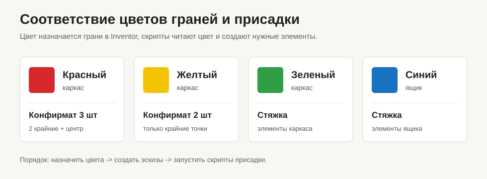

# Автоматизация мебельной присадки в Autodesk Inventor

Набор Python-скриптов для создания эскизов и отверстий мебельной присадки в активной `.ipt`-детали Autodesk Inventor через COM.

Основной сценарий работы:

1. В Inventor назначить рабочим граням цвета.
2. Запустить `00_createSketches.py`, чтобы создать эскизы с точками присадки.
3. Запустить нужные скрипты конфирматов и стяжек.



## Цвета

| Цвет грани | Что создается | Скрипт |
| --- | --- | --- |
| Красный | Конфирмат, 3 точки: две крайние и центральная | `03_confirmat_3штКаркас_на_Красн.py` |
| Желтый | Конфирмат, 2 точки: две крайние | `02_confirmat_2штКаркас_на_Жел.py` |
| Зеленый | Стяжка для каркаса | `01_stiajkaКаркас_на_Зел.py` |
| Синий | Стяжка для ящика | `01_stiajkaЯщик_на_Син.py` |

Красные, желтые и зеленые грани считаются гранями каркасной присадки и получают эскизы с префиксом `DrillingSketch`. Синие грани получают эскизы с префиксом `DrawerSketch`.

## Требования

- Autodesk Inventor уже запущен.
- Открыта активная `.ipt`-деталь.
- Установлен Python и пакет `pywin32`.
- Python и Inventor запущены с одинаковыми правами пользователя, иначе COM-подключение может не сработать.

## Обязательные параметры Inventor

В детали должны быть пользовательские параметры:

```text
Минимальный_отступ_присадки_от_кромки_Каркас
Минимальный_отступ_присадки_от_кромки_Ящик
Стяжка_D
Стяжка_h
Стяжка_отступ
```

Если параметра нет, скрипт показывает окно с перечнем отсутствующих параметров и останавливается.

## Быстрый запуск

Сначала создать или обновить эскизы:

```powershell
python 00_createSketches.py
```

Затем запустить нужную операцию:

```powershell
python 03_confirmat_3штКаркас_на_Красн.py
python 02_confirmat_2штКаркас_на_Жел.py
python 01_stiajkaКаркас_на_Зел.py
python 01_stiajkaЯщик_на_Син.py
```

Диагностика последних эскизов:

```powershell
python inspect_sketches.py
```

## Запуск через кнопку

Для кнопок Inventor можно использовать общий запускатель:

```text
scripts\launcher.bat
```

Каждой кнопке нужно передать свой аргумент:

| Кнопка | Аргумент |
| --- | --- |
| Создать эскизы | `sketches` |
| Конфирмат 3 | `confirmat3` |
| Конфирмат 2 | `confirmat2` |
| Стяжка каркас | `stiajka_frame` |
| Стяжка ящик | `stiajka_drawer` |

Примеры ручного запуска:

```powershell
scripts\launcher.bat sketches
scripts\launcher.bat confirmat3
scripts\launcher.bat confirmat2
scripts\launcher.bat stiajka_frame
scripts\launcher.bat stiajka_drawer
```

Готовые внешние правила iLogic лежат в папке:

```text
scripts\ilogic
```

В Inventor подключите эту папку как External Rules:

1. Откройте `iLogic Browser`.
2. Перейдите на вкладку `External Rules`.
3. Добавьте папку `scripts\ilogic` в настройки внешних правил iLogic.
4. Проверьте запуск правила `01_CreateSketches`.
5. Откройте `Tools / Инструменты -> Options / Параметры -> Customize / Настройка`.
6. На вкладке `Ribbon / Лента` выберите команды `iLogic Rules`.
7. Добавьте правила `01_CreateSketches`, `02_Confirmat3`, `03_Confirmat2`, `04_StiajkaFrame`, `05_StiajkaDrawer` на нужную панель ленты.

## Эскизы

`00_createSketches.py` собирает цветные грани, группирует их по плоскости и цвету, а затем создает эскизы с точками присадки.

Для каждой рабочей грани строятся:

- ось по центру длинных ребер;
- пять точек на оси: крайняя левая, внутренняя левая, центральная, внутренняя правая, крайняя правая;
- размеры, привязанные к пользовательским параметрам отступа.

Шаг сетки между точками кратен 32 мм. Расстояние между крайними точками считается от длины грани и минимального отступа от кромки:

```text
floor((Long_edge_N - отступ * 2) / 32 мм) * 32 мм
```

Если на плоскости уже есть подходящий эскиз с тем же цветом, скрипт переиспользует его. Если геометрия для конкретной грани уже есть, грань пропускается.

## Конфирмат

Красная грань:

```powershell
python 03_confirmat_3штКаркас_на_Красн.py
```

Создает отверстия по двум крайним точкам и центральной точке оси.

Желтая грань:

```powershell
python 02_confirmat_2штКаркас_на_Жел.py
```

Создает отверстия только по двум крайним точкам.

Размеры конфирмата берутся из блока `confirmat` в `settings.json`.

## Стяжка

Зеленая грань каркаса:

```powershell
python 01_stiajkaКаркас_на_Зел.py
```

Синяя грань ящика:

```powershell
python 01_stiajkaЯщик_на_Син.py
```

Стяжка использует крайние точки оси для наружных отверстий и внутренние точки для встречных отверстий. Для чашки создается отдельный боковой эскиз `StiajkaSideSketch`; точки чашки привязываются к центрам спроецированной геометрии конца отверстия.

Размеры и имена создаваемых элементов берутся из блока `stiajka` в `settings.json`.

## Настройки

Основные настройки лежат в `settings.json`.

`inventor_api` содержит служебные коды Inventor:

- `hole_direction.positive` и `hole_direction.negative` - направления сверления;
- `dimension_orientation.horizontal`, `vertical`, `aligned` - типы размеров в эскизе.

`confirmat` задает:

- `debug` - дополнительные сообщения диагностики;
- `outer` - основное отверстие конфирмата;
- `inner` - встречное отверстие конфирмата.

`stiajka` задает:

- `parameters` - имена пользовательских параметров Inventor;
- `side_offset` - запасной боковой отступ, если параметр не найден;
- `outer_main`, `outer_secondary`, `inner_short`, `inner_long` - отверстия стяжки;
- `cup` - отверстие чашки стяжки.

Размеры можно задавать строками с единицами Inventor, например `"5 mm"` или `"35 mm"`.

## Структура проекта

```text
00_createSketches.py                 - создание эскизов по цветным граням
01_stiajkaКаркас_на_Зел.py            - стяжка по зеленым граням
01_stiajkaЯщик_на_Син.py              - стяжка по синим граням
02_confirmat_2штКаркас_на_Жел.py      - конфирмат по желтым граням
03_confirmat_3штКаркас_на_Красн.py    - конфирмат по красным граням
inspect_sketches.py                  - диагностика эскизов
settings.json                        - размеры и служебные настройки
common/                              - общие функции Inventor, граней и эскизов
confirmat/                           - логика конфирмата
stiajka/                             - логика стяжки
sketch/                              - построение эскизов присадки
docs/                                - иллюстрации
```

## Важные замечания

- Цветовая разметка управляет логикой проекта: код не угадывает назначение грани, а выполняет правила по цветам.
- После создания отверстий скрипты сбрасывают цвет обработанных граней к цвету элемента Inventor.
- Размеры Inventor API часто возвращаются во внутренних единицах, обычно в сантиметрах.
- Перед массовым запуском лучше проверить модель на копии детали.
